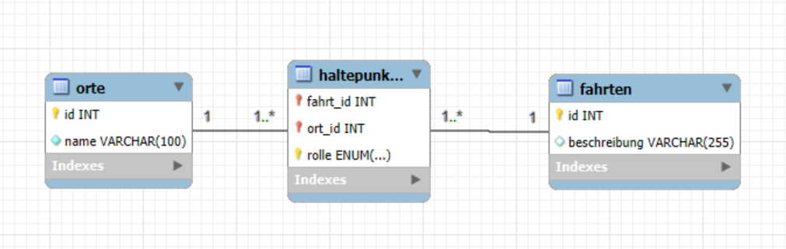

# Modul_164

## Recap Modul 162: Allgemein

**1. Welche Stufen gibt es bei der Wissenstreppe?**
**Nennen Sie diese der Reihe nach und machen Sie ein Beispiel mit einem Wechselkurs.**
1. Zeichen
2. Daten
3. Information
4. Wissen
5. Handeln
6. Kompetenz
7. Wettbewerbsfähigkeit

**2. Wie werden Netzwerk-Beziehungen im logischen Modell abgebildet?**

Es gibt Relationen zwischen Tabellen. Die Relationen sind 1:1, 1:n und n:m. Sie haben Primär- und Fremdschlüssel.

**3. Was sind Anomalien in einer Datenbasis? Welche Arten gibt es?**

Anomalien sind unerwünschte Nebeneffekte bei der Datenverarbeitung.

Einfügeanomalie: Daten können nicht eingefügt werden.
Löschanomalie: Beim Löschen gehen ungewollt Daten verloren.
Änderungsanomalie: Daten sind inkonsistent nach einer Änderung.

**4. Gibt es redundante "Daten"? Warum?**

Ja, wenn Informationen mehrfach gespeichert werden.
Führt zu Inkonsistenzen und Platzverschwendung.

**5. Datenstrukturierung bei der Erhebung und Ablage von Daten:**
**Welche zwei Aspekte können strukturiert werden?**
**Welche Kategorien (Abstufungen) gibt es bei der Strukturierung?**
**Und wie müssen die Daten in einer DB strukturiert sein?**

Zwei Aspekte: Inhalt und Zugriff.
Kategorien: unstrukturiert, semistrukturiert, strukturiert.
DB-Struktur: Daten müssen normalisiert und in Relationen aufgeteilt sein.

**6. Beschreiben das Bild mit den richtigen Fachbegriffen**


1. Entität
2. Primärschlüssel
3. Attribut
4. Attributwert (Datensatz)

**7. Welche (einschränkenden) Einstellungen zu den Attributen (z.B. ID) kennen Sie?**


Primärschlüssel: Eindeutigkeit (Darf nur einmal vorkommen)
Fremdschlüssel: Referenz auf andere Tabelle
NOT NULL: Wert muss vorhanden sein
UNIQUE/Redundanz: Keine doppelten Werte

## Recap Modul 162: Normalisierung

**Ziel:** Struktur für Daten finden, um Datenbanken zu bauen

### Drei Arten von Datenmodellen

1. **Konzeptionelles Modell**

    Es zeigt, welche Daten es gibt und wie sie zusammenhängen, aber ohne technische Details.

2. **Logisches Modell**  
   Übertragt das Konzept auf eine Datenbank mit Schlüsseln.

3. **Physisches Modell**  
   Hier steht, wie die Datenbank aufgebaut ist (Tabellen).

### Modellformen je nach Einsatz

- **3NF:** für Eingabesysteme (z. B. ERP)  
- **Star Schema:** für Auswertungen (z. B. Reporting)  
- **Data Vault:** für flexible und automatisierte Systeme

### Normalisierungsschritte

1. **NF:**  
   - Alle Felder enthalten nur einen Wert, oft keine Listen oder Gruppen. (unstrukturiert)

2. **NF:**  
   - Erfüllt 1NF und alle Felder hängen vollständig vom ganzen Primärschlüssel von 1. Normalform ab.

3. **NF:**  
   - In der 3. Normalform müssen die ersten zwei Normalformen erfüllt sein und alle Daten hängen nur vom Schlüssel ab nicht von normalen Daten.

## Generalisierung

In der Datenbankmodellierung werden gemeinsame Attribute mehrerer Entitätstypen in einem allgemeinen Entitätstyp zusammengefasst (Generalisierung), um Redundanzen zu vermeiden. Spezifische Attribute bleiben in spezialisierten Entitätstypen (Spezialisierung). Die spezialisierten Entitäten verweisen per Fremdschlüssel auf den allgemeinen Typ, was als „is_a“-Beziehung bezeichnet wird. Das entspricht der Vererbung in der objektorientierten Programmierung.


## Beziehungsarten: Indentifying / Non-Identifying Relationship

Identifying Relationships sind Beziehungen, bei denen der Fremdschlüssel Teil des Primärschlüssels ist und zur eindeutigen Identifikation gehört. Bei Non-Identifying Relationships ist der Fremdschlüssel nur eine Referenz und kein Teil des Primärschlüssels, wodurch die Beziehung flexibler ist.


Obere Beziehung: Non-Identifying Relationship
Untere Beziehung:  Identifying Relationship

Ich habe das ganze mit Herr Wiesendanger angeschaut und ich habe mir neue respektiv andere Baspiele für Beziehungen angeschaut.
Ein Beispiel währe z.B. Kunde zu Rechnung welche eine Non-Identifying Beziehung ist.

## CREATE, ALTER, DROP

[CREATE_ALTER_DROP](./CREATE_ALTER_DROP.sql)

## Recap Datentypen

| **Datentyp**                             | **MariaDB (MySQL)**     | **Beispiel**       | **Bemerkung / Einstellungen**                                  |
|-----------------------------------------|--------------------------|--------------------|-----------------------------------------------------------------|
| Ganze Zahlen                            | INT                      | 42, 0, -3            | Ganze Zahlen ohne Nachkommastellen (können auch negative zahlen sein)   |
| Natürliche Zahlen                       | UNSIGNED INT             | 17                 | Keine negativen Zahlen erlaubt                                 |
| Festkommazahlen (Dezimalzahlen)         | DECIMAL(M,D)             | DECIMAL(6,2) 1234.56 | M = gesamte Stellen, D = Nachkommastellen   6-2 = 4 vor Komma  |
| Aufzählungstypen                        | ENUM('S', 'M', 'L')      | 'M'                | Vordefinierte Auswahlwerte (grösse)                              |
| Boolean (logische Werte)                | BOOLEAN / TINYINT(1)     | TRUE / FALSE       | TRUE = 1, FALSE = 0                                            |
| Zeichen (einzelnes Zeichen)             | CHAR(1)                  | 'A'                | Genau ein Zeichen                                              |
| Gleitkommazahlen                        | FLOAT / DOUBLE           | 3.14159            | Kommazahlen                                                    |
| Zeichenkette fester Länge               | CHAR(m)                  | 'Hallo'            | Immer exakt m Zeichen, möglich mit Leerzeichen = Zeichen       |
| Zeichenkette variabler Länge            | VARCHAR(m)               | 'Hallo Welt'      | Bis zu m Zeichen, speichert nur die tatsächlich genutzte Länge |
| Datum und/oder Zeit                     | DATE / TIME / DATETIME   | 2025-06-06         | DATE = Datum, TIME = Uhrzeit, DATETIME = beides                |
| Zeitstempel                             | TIMESTAMP                | CURRENT_TIMESTAMP  | Speichert Zeitstempel, oft für Änderungen                      |
| Binäre Datenobjekte variabler Länge     | BLOB                     | (z.B. Bilddaten)   | Für Binärdaten wie Bilder oder Dateien                         |
| Verbund                                 | SET('A', 'B', 'C')       | 'A,B'              | Mehrfachauswahl möglich ähnlich wie ENUM                       |
| JSON                                    | JSON                     | {"key": "value"}   | Speichert strukturierte JSON-Daten                             |

## Tourenplaner Beziehungen

Für folgenden Auftrag habe ich mich für Mehrfachbeziehung entschieden und habe eine solche Beziehung erstellt. Ich habe für dies diese 3 Entitäten benutzt: Fahrten, Orte und Haltepunkt.



## INSERT

```
USE modul_164;

CREATE TABLE IF NOT EXISTS kunden (
    kunde_id INT PRIMARY KEY AUTO_INCREMENT NOT NULL,
    vorname VARCHAR(255),
    nachname VARCHAR(255),
    land_id INT,
    wohnort VARCHAR(255)
);

INSERT INTO kunden (vorname, nachname, wohnort, land_id) VALUES ('Heinrich', 'Schmitt', 'Zürich', 2);
INSERT INTO kunden (vorname, nachname, wohnort, land_id) VALUES ('Sabine', 'Müller', 'Bern', 2);
INSERT INTO kunden (vorname, nachname, wohnort, land_id) VALUES ('Markus', 'Mustermann', 'Wien', 1);

INSERT INTO kunden (kunde_id, vorname, nachname, wohnort, land_id) VALUES (NULL, 'Herr', 'Maier', NULL, NULL);
INSERT INTO kunden (kunde_id, vorname, nachname, wohnort, land_id) VALUES (NULL, 'Herr', 'Bulgur', 'Sirnach', NULL);
INSERT INTO kunden (kunde_id, vorname, nachname, wohnort, land_id) VALUES (NULL, 'Maria', 'Manta', NULL, NULL);
```

**a.**
INSERT INTO **kunden** (nachname, wohnort, land_id) VALUES ('Fesenkampp', 'Duis-burg', 3);

**b.**
INSERT INTO kunden (**vorname**) VALUES ('Herbert');

**c.**
INSERT INTO kunden (nachname, vorname, wohnort, land_id) VALUES ('Schulter', 'Albert', 'Duisburg', **'3'**);

**d.**
INSERT INTO kunden **(nachname, vorname, land_id, wohnort) VALUES** ('', 'Brunhild', 'Sulcher', 1, 'Süderstade');

**e.**
INSERT INTO kunden **(vorname, nachname, land_id, wohnort)** VALUES ('Jochen', 'Schmied', 2, 'Solingen');

**f.**
INSERT INTO kunden **(vorname, nachname, land_id)** VALUES (**'NULL'**, 'Doppelbrecher', 2);

**g.**
INSERT INTO kunden (**vorname**, nachname, wohnort, land_id) VALUES ('Christoph', 'Fesenkampp', 'Duisburg', 3);

**h.**
INSERT INTO kunden (vorname) VALUES ('Herbert');

**i.**
INSERT INTO kunden (nachname, vorname, wohnort, land_id) VALUES (**'**Schulter**'**, **'**Albert**'**, **'**Duisburg**'**, 1);

**j.**
INSERT INTO kunden (kunde_id, vorname, nachname, land_id, wohnort) VALUES (**'NULL'**, **'**Brunhild**'**, **'**Sulcher**'**, 1, **'**Süderstade**'**);

**k.**
INSERT INTO kunden (kunde_id, vorname, nachname, land_id, wohnort) VALUES (**'NULL'**, 'Jochen', 'Schmied', 2, **'**Solingen**'**);

## UPDATE, DELETE, ALTER und DROP

```
USE modul_164;

DROP SCHEMA IF EXISTS filmeDatenbank;
CREATE SCHEMA filmeDatenbank;
USE filmeDatenbank;
CREATE TABLE dvd_sammlung (
  id int(11) NOT NULL auto_increment,
  film varchar(255) NOT NULL,
  nummer int(11) NOT NULL,
  laenge_minuten int(11) NOT NULL,
  regisseur varchar(255) NOT NULL,
  PRIMARY KEY  (id),
  UNIQUE KEY nummer (nummer)
);


INSERT INTO dvd_sammlung VALUES(1, 'Meine Grossmutter lacht nie', 1, 119, 'Quentin Tarantino');
INSERT INTO dvd_sammlung VALUES(2, 'Angst', 2, 92, 'Steven Spielberg');
INSERT INTO dvd_sammlung VALUES(3, 'Wenn ich nur könnte', 3, 89, 'Quentin Tarantino');
INSERT INTO dvd_sammlung VALUES(4, 'Men and Mice', 4, 88, 'Cohen');
INSERT INTO dvd_sammlung VALUES(6, 'Grün ist die Farbe der Liebe', 5, 201, 'Quentin Tarantino');
INSERT INTO dvd_sammlung VALUES(7, 'Frühstück in Sibirien', 6, 72, 'Steven Spielberg');
INSERT INTO dvd_sammlung VALUES(8, 'Das grosse Rennen', 8, 83, 'Cohen');
INSERT INTO dvd_sammlung VALUES(9, 'Das grosse Rennen, Teil 2', 9, 85, 'Cohen');
INSERT INTO dvd_sammlung VALUES(10, 'Adlatus', 7, 131, 'Quentin Tarantino');
INSERT INTO dvd_sammlung VALUES(11, 'Angriff auf Rom', 10, 138, 'Steven Burghofer');

UPDATE dvd_sammlung SET regisseur = 'Etan Cohen' WHERE regisseur = 'Cohen';

UPDATE dvd_sammlung SET laenge_minuten = 120 WHERE film = 'Angst';

RENAME TABLE dvd_sammlung TO bluray_sammlung;

ALTER TABLE bluray_sammlung ADD COLUMN preis DECIMAL(5,2);

DELETE FROM bluray_sammlung WHERE film = 'Angriff auf Rom' AND regisseur = 'Steven Burghofer';

ALTER TABLE bluray_sammlung CHANGE COLUMN film kinofilme VARCHAR(255);

ALTER TABLE bluray_sammlung DROP COLUMN nummer;

DROP TABLE IF EXISTS filmverleih;
 ```

## SELECT

```
USE modul_164;
--
-- Tabellenstruktur für Tabelle dvd_sammlung
--
DROP SCHEMA IF EXISTS filmeDatenbank;
CREATE SCHEMA filmeDatenbank;
USE filmeDatenbank;
CREATE TABLE dvd_sammlung (
  id int(11) NOT NULL auto_increment,
  film varchar(255) NOT NULL,
  nummer int(11) NOT NULL,
  laenge_minuten int(11) NOT NULL,
  regisseur varchar(255) NOT NULL,
  PRIMARY KEY  (id),
  UNIQUE KEY nummer (nummer)
);

--
-- Daten für Tabelle dvd_sammlung
--

INSERT INTO dvd_sammlung VALUES(1, 'Meine Grossmutter lacht nie', 1, 119, 'Quentin Tarantino');
INSERT INTO dvd_sammlung VALUES(2, 'Angst', 2, 92, 'Steven Spielberg');
INSERT INTO dvd_sammlung VALUES(3, 'Wenn ich nur könnte', 3, 89, 'Quentin Tarantino');
INSERT INTO dvd_sammlung VALUES(4, 'Men and Mice', 4, 88, 'Cohen');
INSERT INTO dvd_sammlung VALUES(6, 'Grün ist die Farbe der Liebe', 5, 201, 'Quentin Tarantino');
INSERT INTO dvd_sammlung VALUES(7, 'Frühstück in Sibirien', 6, 72, 'Steven Spielberg');
INSERT INTO dvd_sammlung VALUES(8, 'Das grosse Rennen', 8, 83, 'Cohen');
INSERT INTO dvd_sammlung VALUES(9, 'Das grosse Rennen, Teil 2', 9, 85, 'Cohen');
INSERT INTO dvd_sammlung VALUES(10, 'Adlatus', 7, 131, 'Quentin Tarantino');
INSERT INTO dvd_sammlung VALUES(11, 'Angriff auf Rom', 10, 138, 'Steven Burghofer');

SELECT * FROM dvd_sammlung;

SELECT film, nummer FROM dvd_sammlung;

SELECT film, regisseur FROM dvd_sammlung;

SELECT * FROM dvd_sammlung WHERE regisseur = 'Quentin Tarantino';

SELECT * FROM dvd_sammlung WHERE regisseur = 'Steven Spielberg';

SELECT * FROM dvd_sammlung WHERE regisseur LIKE 'Steven%';

SELECT * FROM dvd_sammlung WHERE laenge_minuten > 120;

SELECT * FROM dvd_sammlung 
WHERE regisseur = 'Quentin Tarantino' OR regisseur = 'Steven Spielberg';

SELECT * FROM dvd_sammlung 
WHERE regisseur = 'Quentin Tarantino' AND laenge_minuten < 90;

SELECT * FROM dvd_sammlung WHERE film LIKE '%Sibirien%';

SELECT * FROM dvd_sammlung WHERE film LIKE 'Das grosse Rennen%';

SELECT * FROM dvd_sammlung ORDER BY regisseur;

SELECT * FROM dvd_sammlung ORDER BY regisseur, film;

SELECT * FROM dvd_sammlung 
WHERE regisseur = 'Quentin Tarantino' 
ORDER BY laenge_minuten DESC;
```
