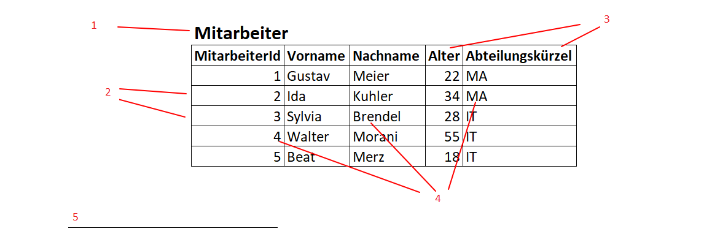
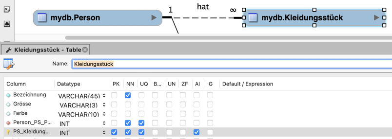
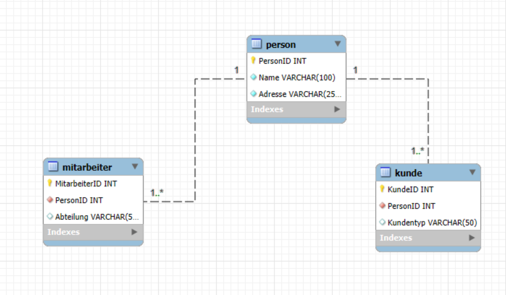
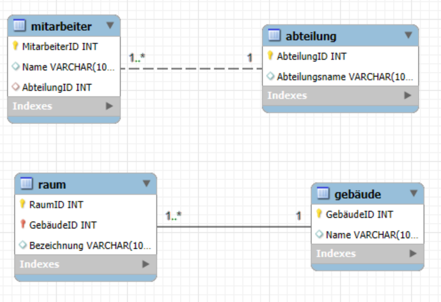

# Modul_164

## Recap Modul 162: Allgemein

**1. Welche Stufen gibt es bei der Wissenstreppe?**
**Nennen Sie diese der Reihe nach und machen Sie ein Beispiel mit einem Wechselkurs.**
1. Zeichen
2. Daten
3. Information
4. Wissen
5. Handeln
6. Kompetenz
7. Wettbewerbsfähigkeit

**2. Wie werden Netzwerk-Beziehungen im logischen Modell abgebildet?**

Es gibt Relationen zwischen Tabellen. Die Relationen sind 1:1, 1:n und n:m. Sie haben Primär- und Fremdschlüssel.

**3. Was sind Anomalien in einer Datenbasis? Welche Arten gibt es?**

Anomalien sind unerwünschte Nebeneffekte bei der Datenverarbeitung.

Einfügeanomalie: Daten können nicht eingefügt werden.
Löschanomalie: Beim Löschen gehen ungewollt Daten verloren.
Änderungsanomalie: Daten sind inkonsistent nach einer Änderung.

**4. Gibt es redundante "Daten"? Warum?**

Ja, wenn Informationen mehrfach gespeichert werden.
Führt zu Inkonsistenzen und Platzverschwendung.

**5. Datenstrukturierung bei der Erhebung und Ablage von Daten:**
**Welche zwei Aspekte können strukturiert werden?**
**Welche Kategorien (Abstufungen) gibt es bei der Strukturierung?**
**Und wie müssen die Daten in einer DB strukturiert sein?**

Zwei Aspekte: Inhalt und Zugriff.
Kategorien: unstrukturiert, semistrukturiert, strukturiert.
DB-Struktur: Daten müssen normalisiert und in Relationen aufgeteilt sein.

**6. Beschreiben das Bild mit den richtigen Fachbegriffen**

1. Entität
2. Primärschlüssel
3. Attribut
4. Attributwert (Datensatz)

**7. Welche (einschränkenden) Einstellungen zu den Attributen (z.B. ID) kennen Sie?**

Primärschlüssel: Eindeutigkeit (Darf nur einmal vorkommen)
Fremdschlüssel: Referenz auf andere Tabelle
NOT NULL: Wert muss vorhanden sein
UNIQUE/Redundanz: Keine doppelten Werte

## Recap Modul 162: Normalisierung

**Ziel:** Struktur für Daten finden, um Datenbanken zu bauen

### Drei Arten von Datenmodellen

1. **Konzeptionelles Modell**

    Es zeigt, welche Daten es gibt und wie sie zusammenhängen, aber ohne technische Details.

2. **Logisches Modell**  
   Übertragt das Konzept auf eine Datenbank mit Schlüsseln.

3. **Physisches Modell**  
   Hier steht, wie die Datenbank aufgebaut ist (Tabellen).

### Modellformen je nach Einsatz

- **3NF:** für Eingabesysteme (z. B. ERP)  
- **Star Schema:** für Auswertungen (z. B. Reporting)  
- **Data Vault:** für flexible und automatisierte Systeme

### Normalisierungsschritte

1. **NF:**  
   - Alle Felder enthalten nur einen Wert, oft keine Listen oder Gruppen. (unstrukturiert)

2. **NF:**  
   - Erfüllt 1NF und alle Felder hängen vollständig vom ganzen Primärschlüssel von 1. Normalform ab.

3. **NF:**  
   - In der 3. Normalform müssen die ersten zwei Normalformen erfüllt sein und alle Daten hängen nur vom Schlüssel ab nicht von normalen Daten.

## Generalisierung

In der Datenbankmodellierung werden gemeinsame Attribute mehrerer Entitätstypen in einem allgemeinen Entitätstyp zusammengefasst (Generalisierung), um Redundanzen zu vermeiden. Spezifische Attribute bleiben in spezialisierten Entitätstypen (Spezialisierung). Die spezialisierten Entitäten verweisen per Fremdschlüssel auf den allgemeinen Typ, was als „is_a“-Beziehung bezeichnet wird. Das entspricht der Vererbung in der objektorientierten Programmierung.

## Beziehungsarten: Indentifying / Non-Identifying Relationship

Identifying Relationships sind Beziehungen, bei denen der Fremdschlüssel Teil des Primärschlüssels ist und zur eindeutigen Identifikation gehört. Bei Non-Identifying Relationships ist der Fremdschlüssel nur eine Referenz und kein Teil des Primärschlüssels, wodurch die Beziehung flexibler ist.

Obere Beziehung: Non-Identifying Relationship
Untere Beziehung:  Identifying Relationship

Ich habe das ganze mit Herr Wiesendanger angeschaut und ich habe mir neue respektiv andere Baspiele für Beziehungen angeschaut.
Ein Beispiel währe z.B. Kunde zu Rechnung welche eine Non-Identifying Beziehung ist.

## CREATE, ALTER, DROP

[CREATE_ALTER_DROP](./CREATE_ALTER_DROP.sql)
